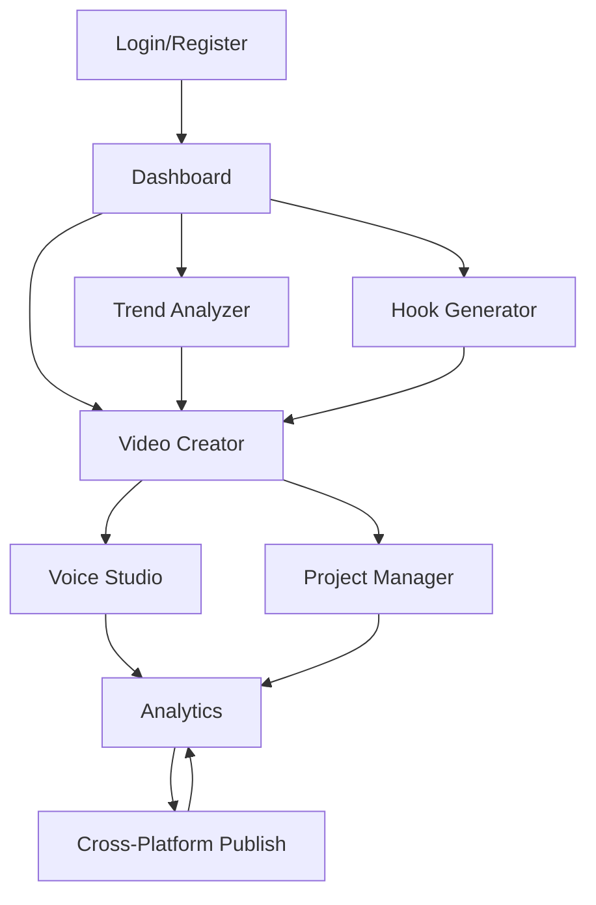

## 1. Product Overview

Platform monetisasi video otomatis untuk YouTube Shorts, YouTube Video, dan TikTok yang menghasilkan konten menarik berbasis tren terkini. Solusi ini membantu kreator konten meningkatkan engagement dan pendapatan melalui video dengan hook kuat di awal, konten dinamis, dan voice over AI yang emosional.

Platform ini ditujukan untuk content creator, digital marketer, dan agency yang ingin menskalakan produksi konten viral secara konsisten dengan mengikuti algoritma dan tren terbaru.

## 2. Core Features

### 2.1 User Roles

| Role        | Registration Method  | Core Permissions                                  |
| ----------- | -------------------- | ------------------------------------------------- |
| Free User   | Email registration   | Membuat 5 video/bulan, watermark platform         |
| Pro User    | Subscription upgrade | Video unlimited, no watermark, analytics lengkap  |
| Agency User | Custom onboarding    | Multi-account management, white-label, API access |

### 2.2 Feature Module

Platform monetisasi video ini terdiri dari halaman-halaman utama:

1. **Dashboard**: Overview performa video, tren terkini, quick actions
2. **Video Creator**: Editor video dengan AI-powered tools, template library, voice over generator
3. **Trend Analyzer**: Analisis tren YouTube dan TikTok, prediksi viral content
4. **Analytics**: Performance metrics, engagement rates, revenue tracking
5. **Hook Generator**: AI generator untuk hook video yang menarik
6. **Voice Studio**: Text-to-speech dengan emosi dan nada alami
7. **Project Manager**: Organisasi dan scheduling konten

### 2.3 Page Details

| Page Name       | Module Name            | Feature description                                                                         |
| --------------- | ---------------------- | ------------------------------------------------------------------------------------------- |
| Dashboard       | Performance Overview   | Menampilkan total views, engagement rate, revenue dari semua platform dalam chart real-time |
| Dashboard       | Trending Topics        | Menampilkan topik viral hari ini dari YouTube dan TikTok dengan prediksi masa depan         |
| Dashboard       | Quick Actions          | Shortcut untuk membuat video baru, upload batch, dan scheduling konten                      |
| Video Creator   | AI Video Editor        | Upload footage, auto-enhance video, add dynamic transitions, speed adjustment               |
| Video Creator   | Template Library       | Pilih dari 100+ template viral untuk berbagai niche (gaming, edukasi, entertainment)        |
| Video Creator   | Smart Trimming         | AI otomatis memotong video untuk hook terbaik di first 3 seconds                            |
| Trend Analyzer  | Platform Integration   | Scraping data tren dari YouTube API dan TikTok API secara real-time                         |
| Trend Analyzer  | Viral Prediction       | Machine learning memprediksi potensi viral berdasarkan historical data                      |
| Trend Analyzer  | Competitor Analysis    | Analisis performa kompetitor dan content gap opportunities                                  |
| Analytics       | Cross-Platform Metrics | Track views, likes, comments, shares, dan revenue dari semua platform                       |
| Analytics       | Audience Insights      | Demografi audience, peak hours, content preferences                                         |
| Analytics       | Revenue Tracking       | Monetization rate, CPM, sponsorship opportunities                                           |
| Hook Generator  | AI Hook Writer         | Generate 10 hook variations berdasarkan topik dan target audience                           |
| Hook Generator  | A/B Testing            | Test berbagai hook untuk optimasi performance                                               |
| Hook Generator  | Hook Database          | Library hook yang pernah viral untuk inspirasi                                              |
| Voice Studio    | AI Voice Generator     | Convert text ke voice over dengan 50+ voice options dan emosi                               |
| Voice Studio    | Emotion Control        | Atur tingkat excitement, seriousness, humor dalam voice over                                |
| Voice Studio    | Multi-Language         | Support 20+ bahasa dengan accent lokal                                                      |
| Project Manager | Content Calendar       | Visual calendar untuk planning dan scheduling konten                                        |
| Project Manager | Batch Operations       | Upload dan edit multiple video sekaligus                                                    |
| Project Manager | Team Collaboration     | Share projects, comments, approval workflow untuk agency                                    |

## 3. Core Process

### User Flow - Content Creator

1. User login ke dashboard dan melihat tren hari ini
2. Memilih topik viral atau memasukkan ide sendiri
3. Menggunakan Hook Generator untuk membuat hook menarik
4. Upload footage atau memilih template dari library
5. AI otomatis mengedit video dengan dynamic cuts dan transitions
6. Menambahkan voice over dengan emosi yang sesuai
7. Preview dan final edit jika diperlukan
8. Schedule atau langsung publish ke YouTube/TikTok
9. Monitor performance melalui analytics dashboard

### Agency Flow

1. Agency membuat workspace untuk multiple client
2. Assign team member dengan role yang berbeda (creator, editor, reviewer)
3. Bulk create konten untuk berbagai client
4. Approval workflow sebelum publishing
5. Generate white-label report untuk client

## 4. User Interface Design

### 4.1 Design Style

* **Primary Colors**: Deep Purple (#6B46C1) untuk aksen utama, Electric Blue (#3B82F6) untuk CTA

* **Secondary Colors**: Dark Gray (#1F2937) untuk background, Light Gray (#F3F4F6) untuk card background

* **Button Style**: Rounded corners (8px radius), gradient hover effects, shadow on hover

* **Typography**: Inter font family, 16px base size, bold untuk headings (600-700 weight)

* **Layout**: Card-based design dengan grid system, sidebar navigation untuk desktop

* **Icons**: Modern line icons dengan consistent stroke width, emoji untuk engagement metrics

* **Animations**: Smooth transitions (300ms), loading skeletons, progress indicators

### 4.2 Page Design Overview

| Page Name      | Module Name            | UI Elements                                                                             |
| -------------- | ---------------------- | --------------------------------------------------------------------------------------- |
| Dashboard      | Performance Overview   | Line chart dengan gradient fill, metric cards dengan icon besar, color-coded indicators |
| Dashboard      | Trending Topics        | Horizontal scrolling cards, hashtag styling, viral indicator badges                     |
| Video Creator  | AI Video Editor        | Timeline editor dengan drag-drop, preview window 16:9, toolbar vertikal kiri            |
| Video Creator  | Template Library       | Grid layout 3 columns, thumbnail preview, hover effects dengan quick preview            |
| Trend Analyzer | Platform Integration   | Side-by-side comparison YouTube vs TikTok, trend score dengan progress bar              |
| Hook Generator | AI Hook Writer         | Text area besar untuk input, hasil dalam card format, copy button tiap hook             |
| Voice Studio   | AI Voice Generator     | Dropdown voice selection, emotion sliders, real-time audio preview                      |
| Analytics      | Cross-Platform Metrics | Tab navigation per platform, comparison charts, export button                           |

### 4.3 Responsiveness

* **Desktop-first approach** dengan breakpoint 1200px, 768px, 480px

* **Mobile optimization** dengan bottom navigation untuk screen < 768px

* **Touch interaction** dengan swipe gestures untuk carousel dan gallery

* **Responsive video player** yang menyesuaikan aspect ratio platform target

* **Collapsible sidebar** untuk mobile view

### 4.4 3D Scene Guidance

Tidak applicable untuk platform ini karena fokus pada video editing dan content creation.

## 5. Additional Requirements

* **Performance**: Video processing < 5 menit untuk video 60 detik

* **Scalability**: Support 10,000+ concurrent users

* **Security**: Enkripsi end-to-end untuk user content

* **Integration**: API YouTube Data v3, TikTok Business API

* **Storage**: Cloud storage untuk video dengan CDN optimization

* **AI Models**: Custom trained models untuk hook generation dan video

