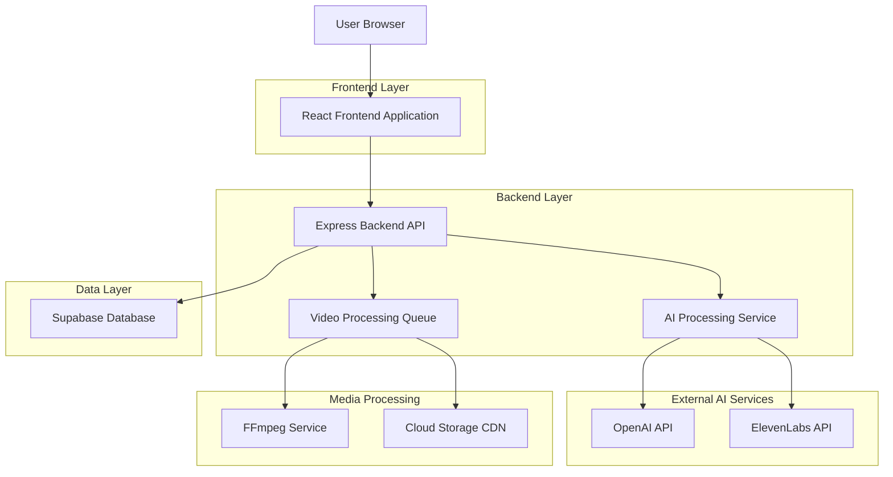
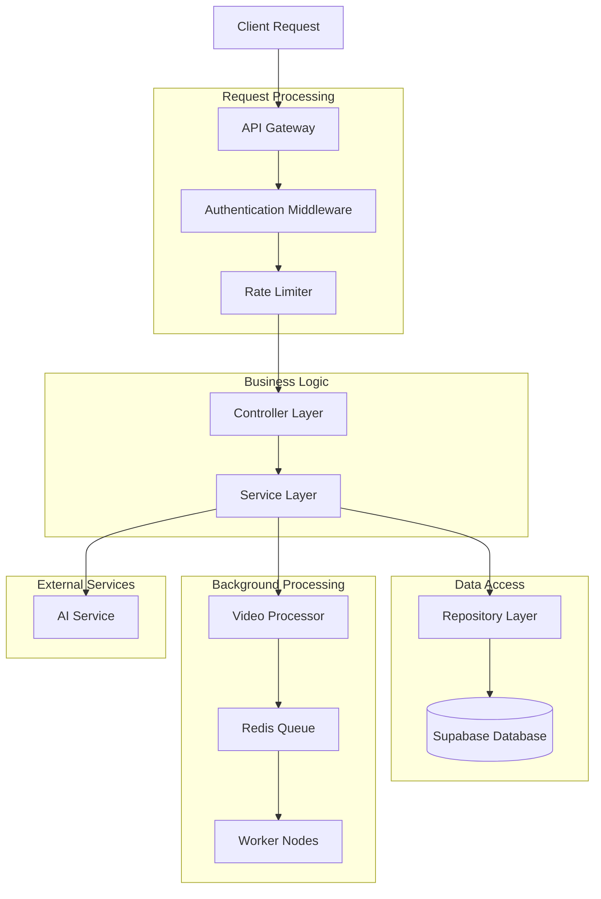
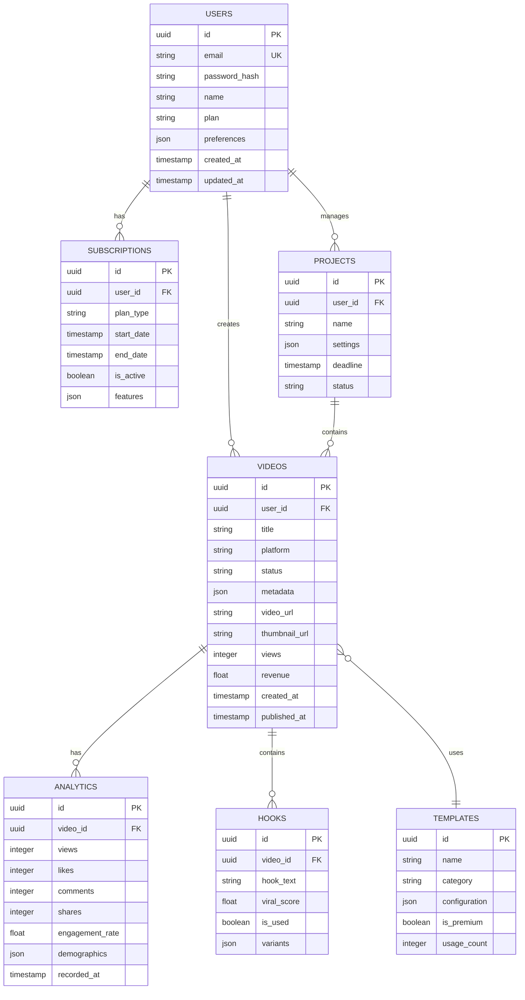

## 1. Architecture design



## 2. Technology Description
- **Frontend**: React@18 + tailwindcss@3 + vite + TypeScript
- **Initialization Tool**: vite-init
- **Backend**: Express@4 + Node.js + TypeScript
- **Database**: Supabase (PostgreSQL)
- **Queue System**: Redis + Bull Queue
- **Video Processing**: FFmpeg + Sharp
- **AI Integration**: OpenAI GPT-4, ElevenLabs API
- **Authentication**: Supabase Auth
- **Storage**: Supabase Storage + Cloudflare CDN

## 3. Route definitions
| Route | Purpose |
|-------|---------|
| / | Landing page dengan hero section dan pricing |
| /dashboard | Main dashboard dengan analytics dan quick actions |
| /login | Authentication page dengan social login |
| /register | User registration dengan plan selection |
| /creator | Video creator dengan editor interface |
| /trends | Trend analyzer dengan platform integration |
| /hooks | Hook generator dengan AI suggestions |
| /voice | Voice studio dengan emotion controls |
| /projects | Project manager dengan calendar view |
| /analytics | Performance metrics dan revenue tracking |
| /settings | User preferences dan account management |
| /api/* | Backend API endpoints untuk semua services |

## 4. API definitions

### 4.1 Authentication API
```
POST /api/auth/login
```

Request:
| Param Name | Param Type | isRequired | Description |
|------------|------------|------------|-------------|
| email | string | true | User email address |
| password | string | true | Encrypted password |

Response:
| Param Name | Param Type | Description |
|------------|------------|-------------|
| token | string | JWT access token |
| user | object | User profile data |
| subscription | object | Current plan details |

Example:
```json
{
  "email": "creator@example.com",
  "password": "encrypted_password"
}
```

### 4.2 Video Creation API
```
POST /api/videos/create
```

Request:
| Param Name | Param Type | isRequired | Description |
|------------|------------|------------|-------------|
| title | string | true | Video title |
| description | string | false | Video description |
| platform | string | true | youtube_shorts, youtube_video, tiktok |
| template_id | string | false | Template identifier |
| raw_footage | file | false | Upload video file |
| hook_text | string | false | Custom hook text |
| voice_config | object | false | Voice settings |

Response:
| Param Name | Param Type | Description |
|------------|------------|-------------|
| video_id | string | Unique video identifier |
| processing_status | string | queued, processing, completed, failed |
| estimated_time | number | Processing time in seconds |

### 4.3 Hook Generation API
```
POST /api/hooks/generate
```

Request:
| Param Name | Param Type | isRequired | Description |
|------------|------------|------------|-------------|
| topic | string | true | Video topic/theme |
| target_audience | string | true | Audience demographics |
| platform | string | true | Target platform |
| tone | string | false | emotional, informative, entertaining |

Response:
| Param Name | Param Type | Description |
|------------|------------|-------------|
| hooks | array | Array of 10 hook variations |
| viral_score | array | Viral potential score for each hook |

### 4.4 Voice Generation API
```
POST /api/voice/generate
```

Request:
| Param Name | Param Type | isRequired | Description |
|------------|------------|------------|-------------|
| text | string | true | Text untuk voice over |
| voice_id | string | true | Voice model identifier |
| emotion | object | false | Emotion configuration |
| language | string | false | Language code (default: id) |

Response:
| Param Name | Param Type | Description |
|------------|------------|-------------|
| audio_url | string | Generated audio file URL |
| duration | number | Audio duration in seconds |
| cost | number | API usage cost |

### 4.5 Trend Analysis API
```
GET /api/trends/current
```

Query Parameters:
| Param Name | Param Type | isRequired | Description |
|------------|------------|------------|-------------|
| platform | string | false | youtube, tiktok, all |
| category | string | false | gaming, education, entertainment, etc |
| region | string | false | Country code |

Response:
| Param Name | Param Type | Description |
|------------|------------|-------------|
| trends | array | Array of trending topics |
| viral_probability | object | Prediction scores |
| related_hashtags | array | Suggested hashtags |

## 5. Server architecture diagram



## 6. Data model

### 6.1 Data model definition


### 6.2 Data Definition Language

**Users Table**
```sql
CREATE TABLE users (
  id UUID PRIMARY KEY DEFAULT gen_random_uuid(),
  email VARCHAR(255) UNIQUE NOT NULL,
  password_hash VARCHAR(255) NOT NULL,
  name VARCHAR(100) NOT NULL,
  plan VARCHAR(20) DEFAULT 'free' CHECK (plan IN ('free', 'pro', 'agency')),
  preferences JSONB DEFAULT '{}',
  created_at TIMESTAMP WITH TIME ZONE DEFAULT NOW(),
  updated_at TIMESTAMP WITH TIME ZONE DEFAULT NOW()
);

CREATE INDEX idx_users_email ON users(email);
CREATE INDEX idx_users_plan ON users(plan);
```

**Videos Table**
```sql
CREATE TABLE videos (
  id UUID PRIMARY KEY DEFAULT gen_random_uuid(),
  user_id UUID REFERENCES users(id) ON DELETE CASCADE,
  title VARCHAR(255) NOT NULL,
  platform VARCHAR(20) CHECK (platform IN ('youtube_shorts', 'youtube_video', 'tiktok')),
  status VARCHAR(20) DEFAULT 'draft' CHECK (status IN ('draft', 'processing', 'completed', 'failed', 'published')),
  metadata JSONB DEFAULT '{}',
  video_url TEXT,
  thumbnail_url TEXT,
  views INTEGER DEFAULT 0,
  revenue DECIMAL(10,2) DEFAULT 0,
  created_at TIMESTAMP WITH TIME ZONE DEFAULT NOW(),
  published_at TIMESTAMP WITH TIME ZONE
);

CREATE INDEX idx_videos_user_id ON videos(user_id);
CREATE INDEX idx_videos_platform ON videos(platform);
CREATE INDEX idx_videos_status ON videos(status);
CREATE INDEX idx_videos_created_at ON videos(created_at DESC);
```

**Subscriptions Table**
```sql
CREATE TABLE subscriptions (
  id UUID PRIMARY KEY DEFAULT gen_random_uuid(),
  user_id UUID REFERENCES users(id) ON DELETE CASCADE,
  plan_type VARCHAR(20) CHECK (plan_type IN ('free', 'pro', 'agency')),
  start_date TIMESTAMP WITH TIME ZONE DEFAULT NOW(),
  end_date TIMESTAMP WITH TIME ZONE,
  is_active BOOLEAN DEFAULT true,
  features JSONB DEFAULT '{}'
);

CREATE INDEX idx_subscriptions_user_id ON subscriptions(user_id);
CREATE INDEX idx_subscriptions_active ON subscriptions(is_active) WHERE is_active = true;
```

**Analytics Table**
```sql
CREATE TABLE analytics (
  id UUID PRIMARY KEY DEFAULT gen_random_uuid(),
  video_id UUID REFERENCES videos(id) ON DELETE CASCADE,
  views INTEGER DEFAULT 0,
  likes INTEGER DEFAULT 0,
  comments INTEGER DEFAULT 0,
  shares INTEGER DEFAULT 0,
  engagement_rate DECIMAL(5,2) DEFAULT 0,
  demographics JSONB DEFAULT '{}',
  recorded_at TIMESTAMP WITH TIME ZONE DEFAULT NOW()
);

CREATE INDEX idx_analytics_video_id ON analytics(video_id);
CREATE INDEX idx_analytics_recorded_at ON analytics(recorded_at DESC);
```

**Templates Table**
```sql
CREATE TABLE templates (
  id UUID PRIMARY KEY DEFAULT gen_random_uuid(),
  name VARCHAR(255) NOT NULL,
  category VARCHAR(50) NOT NULL,
  configuration JSONB NOT NULL,
  is_premium BOOLEAN DEFAULT false,
  usage_count INTEGER DEFAULT 0
);

CREATE INDEX idx_templates_category ON templates(category);
CREATE INDEX idx_templates_premium ON templates(is_premium);
```

**Hooks Table**
```sql
CREATE TABLE hooks (
  id UUID PRIMARY KEY DEFAULT gen_random_uuid(),
  video_id UUID REFERENCES videos(id) ON DELETE CASCADE,
  hook_text TEXT NOT NULL,
  viral_score DECIMAL(3,2) DEFAULT 0,
  is_used BOOLEAN DEFAULT false,
  variants JSONB DEFAULT '[]'
);

CREATE INDEX idx_hooks_video_id ON hooks(video_id);
CREATE INDEX idx_hooks_viral_score ON hooks(viral_score DESC);
```

**Projects Table**
```sql
CREATE TABLE projects (
  id UUID PRIMARY KEY DEFAULT gen_random_uuid(),
  user_id UUID REFERENCES users(id) ON DELETE CASCADE,
  name VARCHAR(255) NOT NULL,
  settings JSONB DEFAULT '{}',
  deadline TIMESTAMP WITH TIME ZONE,
  status VARCHAR(20) DEFAULT 'active' CHECK (status IN ('active', 'completed', 'archived'))
);

CREATE INDEX idx_projects_user_id ON projects(user_id);
CREATE INDEX idx_projects_status ON projects(status);
```

**Row Level Security (RLS) Policies**
```sql
-- Enable RLS
ALTER TABLE users ENABLE ROW LEVEL SECURITY;
ALTER TABLE videos ENABLE ROW LEVEL SECURITY;
ALTER TABLE subscriptions ENABLE ROW LEVEL SECURITY;
ALTER TABLE analytics ENABLE ROW LEVEL SECURITY;
ALTER TABLE projects ENABLE ROW LEVEL SECURITY;

-- Grant access permissions
GRANT SELECT ON users TO anon;
GRANT ALL PRIVILEGES ON users TO authenticated;
GRANT SELECT ON videos TO anon;
GRANT ALL PRIVILEGES ON videos TO authenticated;
GRANT SELECT ON subscriptions TO anon;
GRANT ALL PRIVILEGES ON subscriptions TO authenticated;
GRANT SELECT ON analytics TO anon;
GRANT ALL PRIVILEGES ON analytics TO authenticated;
GRANT SELECT ON templates TO anon;
GRANT ALL PRIVILEGES ON templates TO authenticated;
GRANT SELECT ON hooks TO anon;
GRANT ALL PRIVILEGES ON hooks TO authenticated;
GRANT SELECT ON projects TO anon;
GRANT ALL PRIVILEGES ON projects TO authenticated;

-- RLS Policies
CREATE POLICY "Users can only see their own data" ON users
  FOR ALL USING (auth.uid() = id);

CREATE POLICY "Users can manage their own videos" ON videos
  FOR ALL USING (auth.uid() = user_id);

CREATE POLICY "Users can view their own subscriptions" ON subscriptions
  FOR ALL USING (auth.uid() = user_id);
```

## 7. Background Processing Architecture

**Video Processing Queue System**
- Redis sebagai message broker
- Bull Queue untuk job management
- Worker nodes terpisah untuk video processing
- Progress tracking real-time via WebSocket
- Retry mechanism untuk failed jobs
- Priority queue untuk pro user

**AI Service Integration**
- OpenAI GPT-4 untuk hook generation dan content analysis
- ElevenLabs untuk AI voice generation
- Rate limiting untuk API calls
- Caching mechanism untuk reduce costs
- Fallback mechanism jika service down

**File Storage Strategy**
- Supabase Storage untuk original files
- Cloudflare CDN untuk optimized delivery
- Automatic compression untuk different qualities
- Signed URLs untuk secure access
- Automatic cleanup untuk expired content